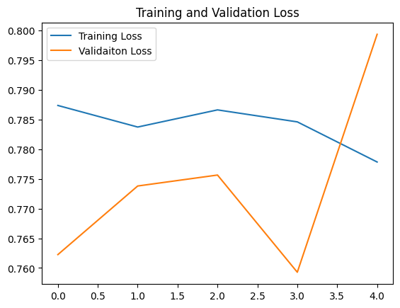
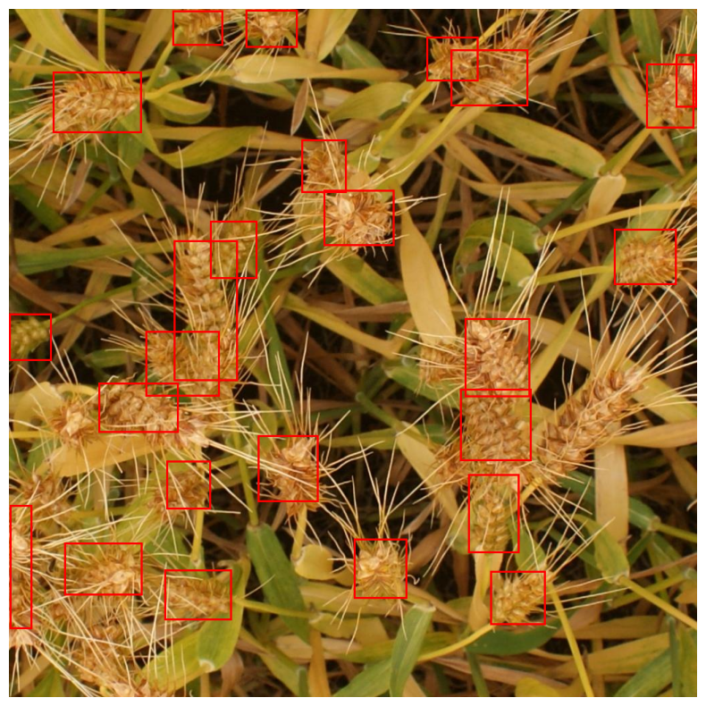
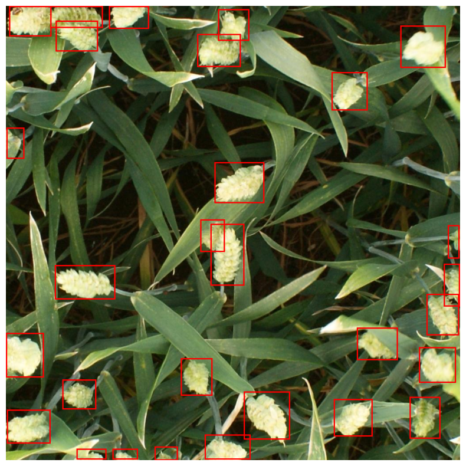
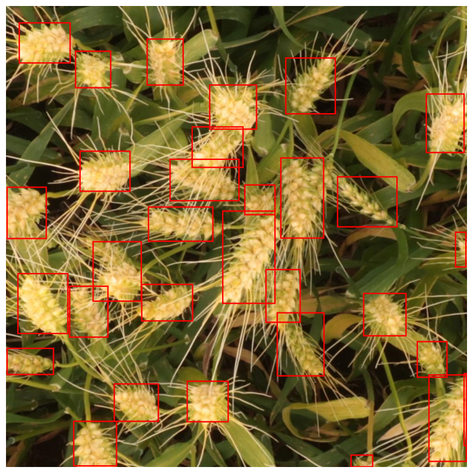

Certainly! Here’s the updated README file with the requested changes:

# Wheat Head Detection Using Faster R-CNN

This repository contains a solution for detecting wheat heads in images using Faster R-CNN, a popular object detection model. The project involves training a Faster R-CNN model to accurately identify and localize wheat heads in images.

## Project Overview

This project demonstrates the use of Faster R-CNN for wheat head detection. Key aspects of the project include:

- **Model Training**: Training a Faster R-CNN model to detect wheat heads in images.
- **Evaluation**: Assessing model performance based on validation loss and detection accuracy.
- **Results**: Visual examples of the model's performance.

## Getting Started

### Prerequisites

Ensure you have the following installed:
- Python 3.x
- PyTorch
- torchvision
- Other dependencies listed in `requirements.txt`

### Installation

1. Clone the repository:
   ```bash
   git clone https://github.com/yourusername/wheat-head-detection-faster-rcnn.git
   ```
2. Navigate to the project directory:
   ```bash
   cd wheat-head-detection-faster-rcnn
   ```
3. Install the required packages:
   ```bash
   pip install -r requirements.txt
   ```

## Results

Below are example results showing the wheat head detection performance of the model. Each image demonstrates the model's ability to accurately detect and localize wheat heads in different scenarios.

### Example Results

1. **Train-Val Loss Graph**
   

2. **Result Image 1**
   

3. **Result Image 2**
   

4. **Result Image 3**
   


